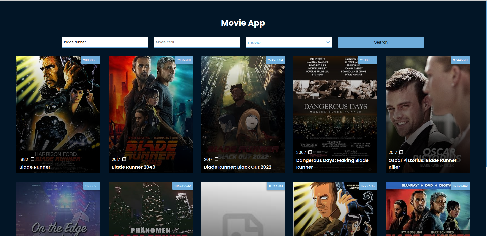
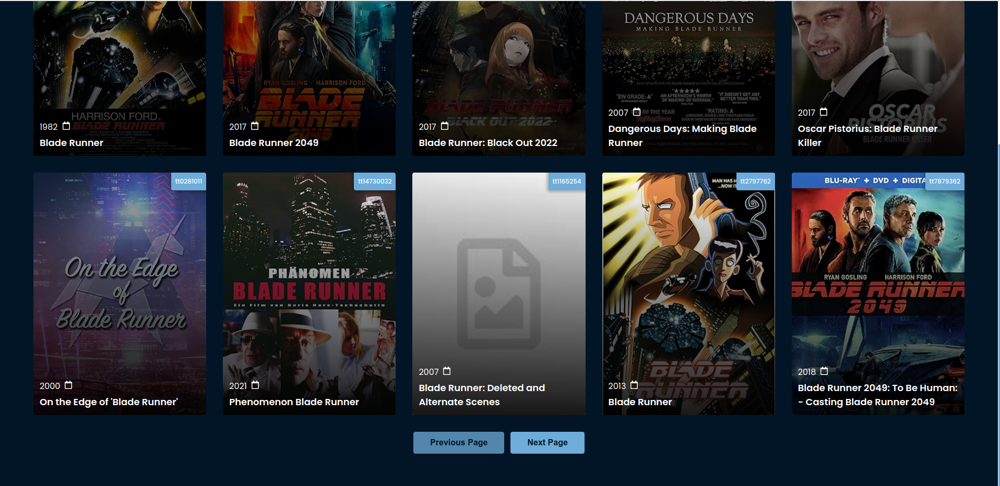
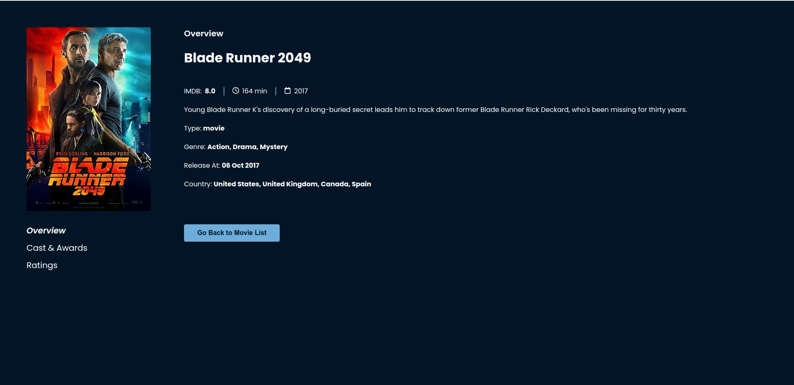
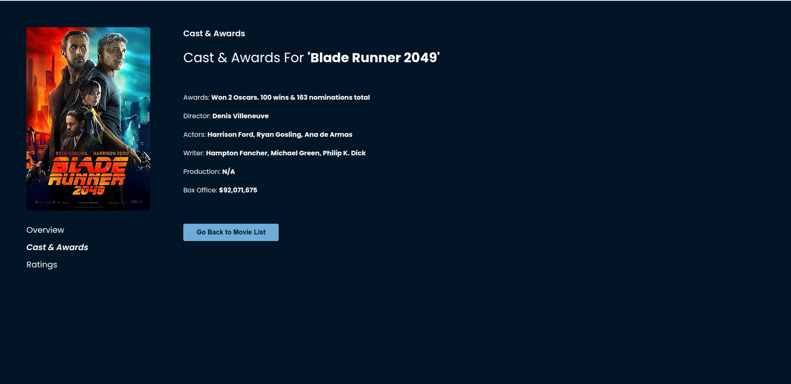
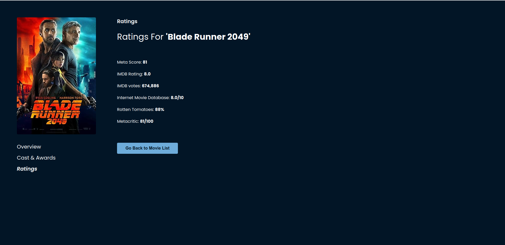

# Invent Analytics Frontend Developer Case

## Project Description

This project has been created for Invent Analytics Frontend Developer Case. It consists of two pages called List and Detail. In list page, movie list is displayed with additional features such as filter and pagination. Detail page has three tabs: Overview, Cast & Awards and Ratings. You can toggle between these tabs.

## Techs Used

- Axios
- Framer Motion
- React
- React Hook Form
- React Router Dom
- React Toastify
- Redux Toolkit
- Typescript
- Vite

## Installation Guide

1. Run `yarn install` or `npm run install`
2. Create `.env` file from `.env.example`
3. Define your environment variables
4. Run the app using `yarn dev` or `npm run dev`
5. Visit http://localhost:3000

## App Images

 

 

 

 

